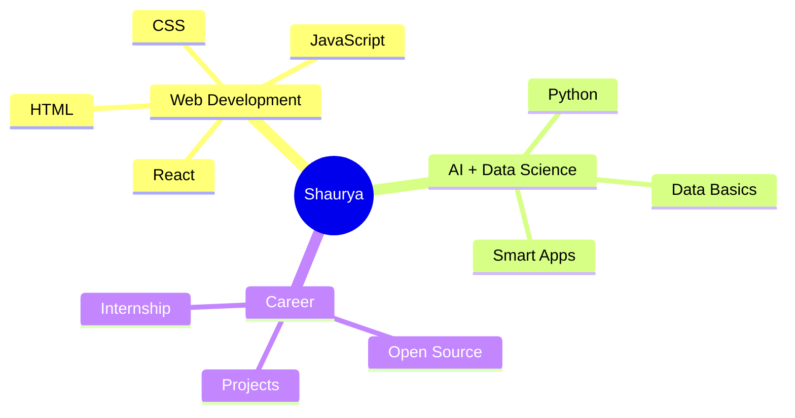

<div align="center">


<br />

<a href="https://github.com/Shauryasx">
  
</a>
<a href="https://github.com/Shauryasx?tab=followers">
  
</a>
<a href="https://github.com/Shauryasx?tab=repositories">
  
</a>

</div>

---

## SYSTEM PROFILE

```txt
Name        : Shaurya Gupta
Location    : Bahraich, Uttar Pradesh, India
University  : Parul University
Core path   : Full Stack Web Development
Side quest  : AI + Data Science
Current kit : HTML, CSS, JavaScript, Python, Git, GitHub, VS Code
Mission     : Learn fast, build clean, ship real projects, improve daily
```

I am a first-year student learning how to turn ideas into real web experiences. Right now I am focused on strengthening my frontend foundation, building consistent projects, and preparing for the full stack path ahead.

---

## CURRENT TRAJECTORY

<table>
  <tr>
    <td width="50%">
      <h3>Learning Now</h3>
      <ul>
        <li>HTML structure and semantic layouts</li>
        <li>CSS styling, responsive design, and UI polish</li>
        <li>JavaScript fundamentals and DOM interaction</li>
        <li>Git, GitHub, and daily development workflows</li>
      </ul>
    </td>
    <td width="50%">
      <h3>Next Unlocks</h3>
      <ul>
        <li>React components and modern frontend architecture</li>
        <li>Backend fundamentals and API development</li>
        <li>AI and data science foundations</li>
        <li>Open-source contributions and internship-ready projects</li>
      </ul>
    </td>
  </tr>
</table>

---

## TECH MATRIX

<div align="center">


<br />
<br />


</div>

---

## GITHUB COMMAND CENTER

<div align="center">


<br />
<br />


<br />
<br />


</div>

---

## 2026 BUILD PROTOCOL

| Status | Objective |
| :---: | --- |
| ACTIVE | Master HTML and CSS through polished responsive pages |
| ACTIVE | Build JavaScript projects with real interactions |
| NEXT | Learn React and component-based development |
| NEXT | Ship 25+ projects and document the journey |
| NEXT | Contribute to open source |
| TARGET | Earn the first internship through consistent proof of work |

---

## PROJECT RADAR



---

## CONNECT

<div align="center">

<a href="https://linkedin.com/in/shauryasx">
  
</a>
<a href="mailto:shauryagupta6306@gmail.com">
  
</a>
<a href="https://github.com/Shauryasx">
  
</a>

</div>

---

<div align="center">


<h3>Code. Learn. Build. Repeat. Upgrade.</h3>

<p>
  <sub>Thanks for visiting. The next commit is always the next level.</sub>
</p>


</div>
